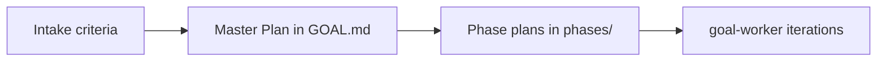

# Hierarchical Plan Protocol

**Default for all `/goal` invocations.** Three planning levels before execution.



## Level 1 — Intake (automatic)

See [intake-protocol.md](intake-protocol.md). Agent only. No code.

## Level 2 — Master Plan (automatic)

**Agent:** goal-planner  
**Output:** `## Master Plan` table in GOAL.md

| Phase | Name | Status | Plan file | Exit criterion |
|-------|------|--------|-----------|----------------|
| 0 | Rulebook | pending | goals/{id}/phases/phase-0.md | C1 |
| 1 | MVP Engine | pending | goals/{id}/phases/phase-1.md | C2 |

Rules:

- Phases from project docs when user says "все фазы" / "all phases"
- Else derive logical milestones from objective
- One row per completion criterion
- `planning_level: master` in frontmatter
- `phases_total: N`, `current_phase: 0` (or first pending)
- **No production code** — only GOAL.md

## Level 3 — Phase Expanded Plans (automatic)

**Agent:** goal-phase-planner — **once per phase**, in order  
**Output:** `goals/{id}/phases/phase-{N}.md` from [PHASE.template.md](../../../../templates/PHASE.template.md)

For each master-plan row:

1. Create `phases/phase-{N}.md`
2. Atomic steps (completable in &lt; 30 min each)
3. Link `criterion_id`, exit criterion, dependencies
4. Map file paths from codebase exploration
5. Master plan row `Status` → `planned`

When **all** phase files exist:

- `planning_level: phase` → ready for execution
- `status: PLANNED`

## Level 4 — Execution

**Agent:** goal-worker + goal-verifier

1. `current_phase` = first phase not `complete` in master table
2. **Active plan file** = that phase's `phases/phase-N.md`
3. `active_step` = first unchecked step in **phase plan** (not master table)
4. One iteration = one phase sub-step
5. When phase plan all `[x]` → verify exit criterion → master row `complete` → next phase
6. When all phases complete → verify all criteria → `COMPLETE`

## Frontmatter Lifecycle

```yaml
planning_level: none → intake → master → phase → executing
status: DRAFT → INTAKE → PLANNING → PLANNED → ACTIVE → CONTINUE → COMPLETE
current_phase: 0..N
```

## Resume

On resume: read `current_phase` and active `phases/phase-N.md` — do not rebuild master/phase plans unless `planning_level` &lt; executing.

## Manual Override

Expert commands still work:

- `/goal plan <id>` — re-run master + phase planning only
- `/goal run <id>` — skip to execution if `PLANNED`
